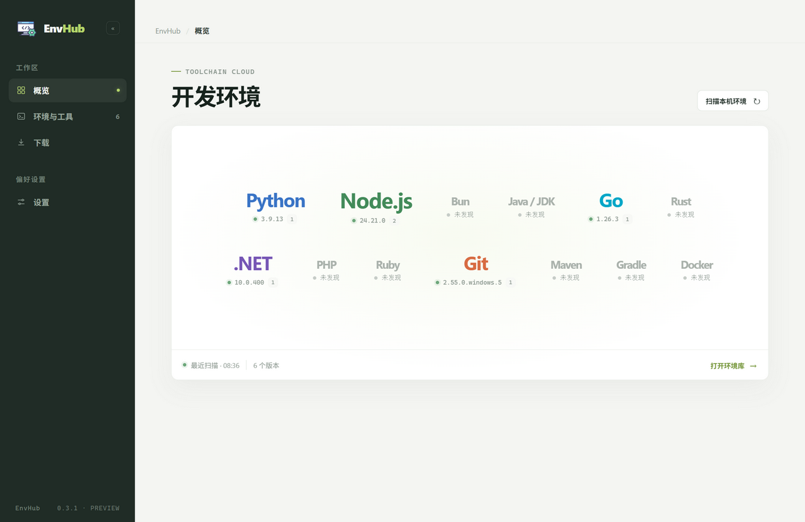
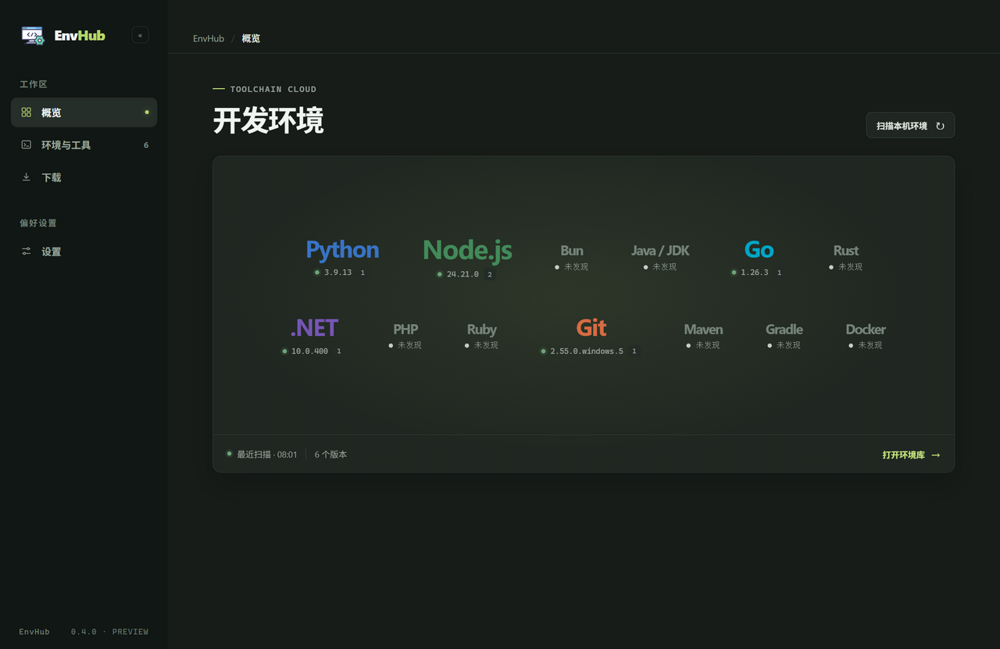
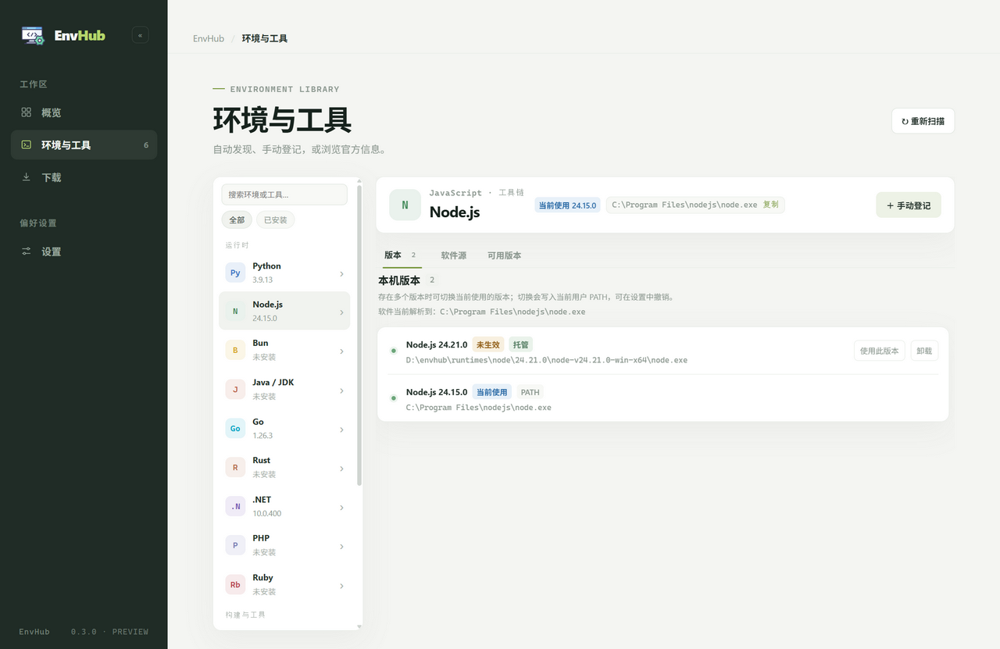
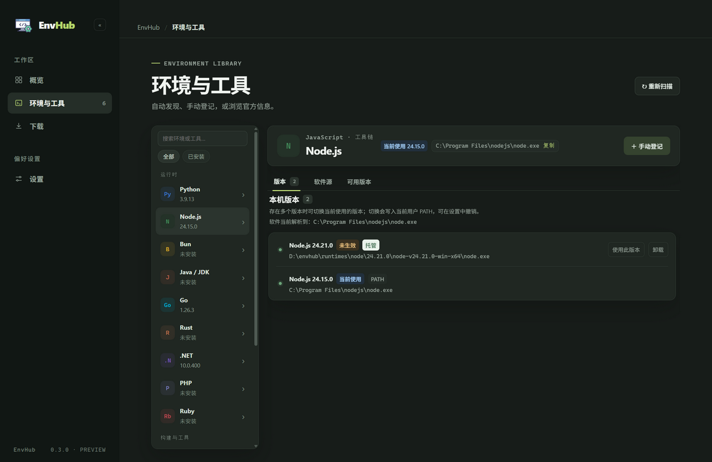
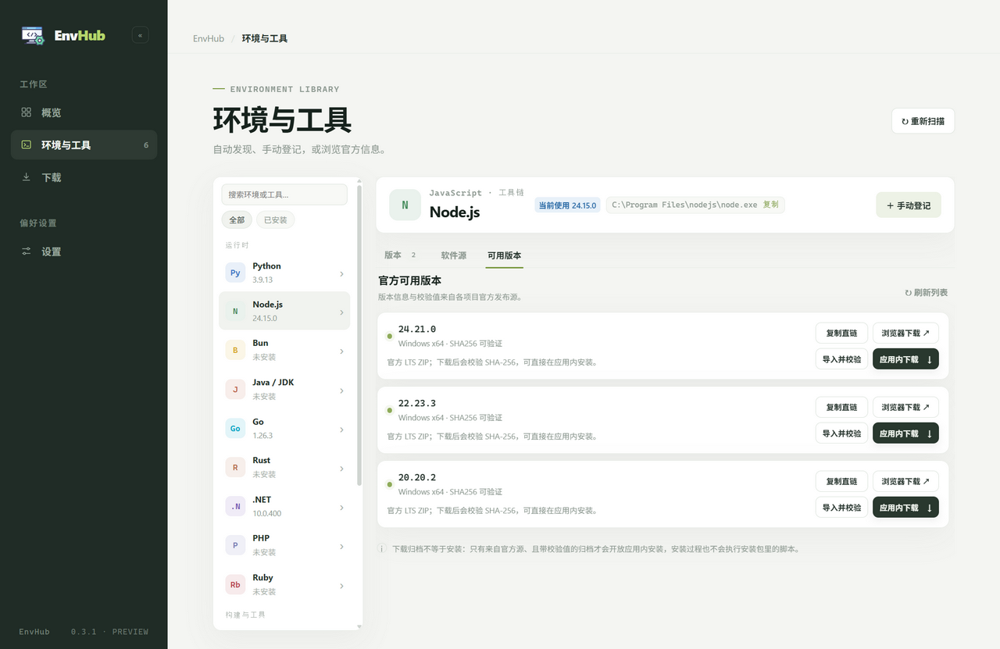
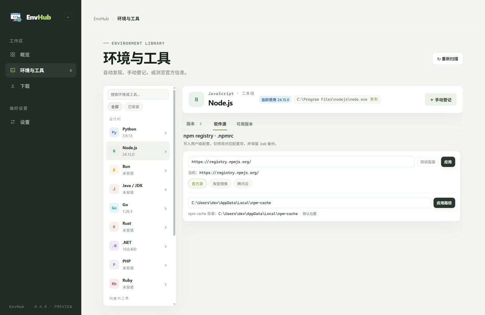
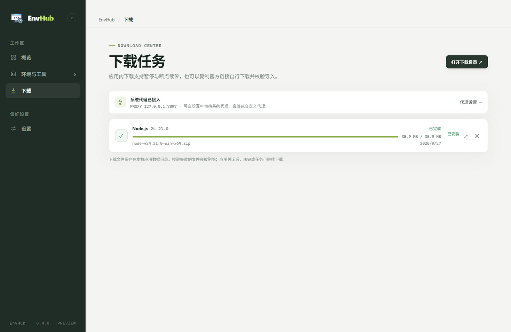
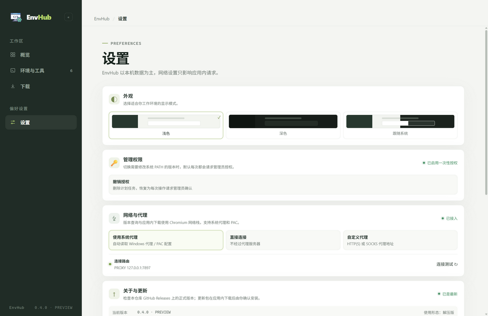
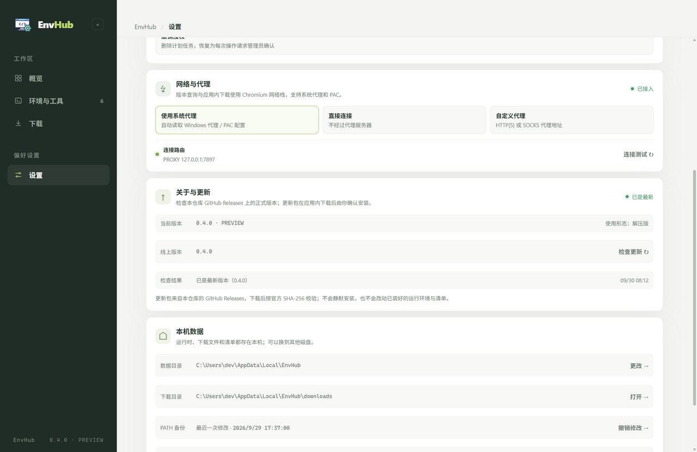
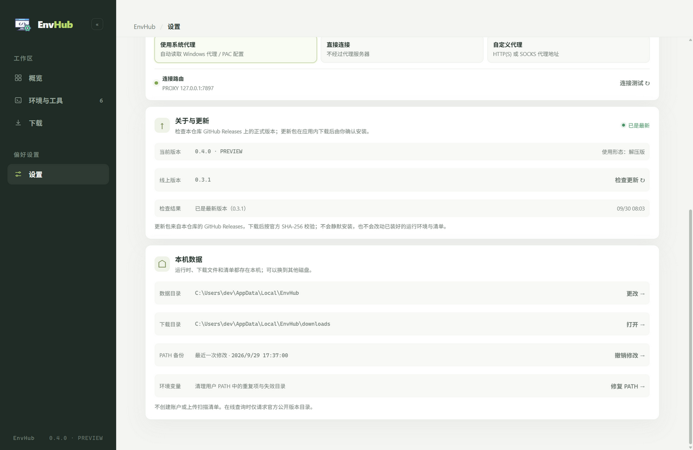

# EnvHub

Windows 本地开发环境管理器。集中查看本机已安装的运行时与版本、切换默认版本、按官方源下载安装新版本，并读写包管理器使用的镜像与缓存配置。

  
  
  
  
  
  

---

## 简介

一台 Windows 开发机上，Python、Node.js、JDK、Go 常常装了不止一套：PATH 里堆着多份同名目录，切换版本靠手改环境变量；包管理器的镜像与缓存又分散在各自的配置文件里。EnvHub 把这些收进一个界面：扫描出本机有什么，把某个版本设为默认，需要新版本时按官方源下载安装，顺带读写 npm / pip / Maven 的镜像与缓存。

- **本机优先**：不登录、不上报、无账号体系，全部数据只保存在本机
- **改动可撤销**：环境变量、软件源配置、数据目录在写入前都保存快照，可逐条恢复
- **默认不动系统**：只写当前用户级环境变量；需要改系统 PATH 时先说明原因，确认后才执行

## 界面

截图取自 0.4.0 的实际界面（示例数据）。

| 概览（浅色） | 概览（深色） |
| --- | --- |
|  |  |

| 环境与工具 · 版本与切换 | 环境与工具 · 版本与切换（深色） |
| --- | --- |
|  |  |

| 环境与工具 · 可用版本 | 环境与工具 · 软件源 |
| --- | --- |
|  |  |

| 下载 | 设置 · 外观与网络 |
| --- | --- |
|  |  |

| 设置 · 关于与更新 | 设置 · 本机数据 |
| --- | --- |
|  |  |

## 功能

| 模块 | 说明 |
| --- | --- |
| 环境检测 | 自动识别 13 个开发环境的已装版本；也可指定可执行文件手动登记 |
| 版本管理 | 切换默认版本（写用户 PATH，JDK 同步 `JAVA_HOME`）；检测系统 PATH 中更靠前的同类目录并在确认后清理；体检用户 PATH 的重复与失效条目 |
| 下载与安装 | 从官方源列出版本：满足"官方 ZIP + 官方校验值"的环境在应用内下载、校验并安装（最多 3 个任务同时下载，支持暂停与断点续传、失败自动回滚），其余提供官方直链；也可导入浏览器下载的归档 |
| 软件源与缓存 | 读写 npm / pip / Maven 的镜像地址与缓存目录 |
| 网络代理 | 跟随系统 / 直接连接 / 自定义，带连接测试 |
| 数据与恢复 | 数据目录可迁移到其他磁盘；异常退出后清理未完成的安装与下载 |
| 应用更新 | 有新版本时提示，按当前发行形态应用内下载，确认后安装 |
| 外观 | 浅色 / 深色 / 跟随系统；侧边栏可折叠 |

## 版本源

版本都来自各项目的官方发布源。满足"官方 ZIP + 官方校验值"的六个环境可在应用内下载并安装；其余环境提供官方直链，下载安装后 EnvHub 会识别到，也可以用「手动登记」把可执行文件加进版本列表。

| 环境 | 版本来源 | 下载方式 |
| --- | --- | --- |
| Node.js | nodejs.org 各 LTS 线 | 应用内下载 + 安装 |
| Bun | 官方 GitHub Releases | 应用内下载 + 安装 |
| Java / JDK | Adoptium Temurin 25 / 21 / 17 / 11 | 应用内下载 + 安装 |
| Go | go.dev 官方版本列表 | 应用内下载 + 安装 |
| Maven | Apache 官方元数据与归档 | 应用内下载 + 安装 |
| Gradle | 官方版本列表 | 应用内下载 + 安装 |
| Python | python.org 官方下载目录 | 官方直链（浏览器下载） |
| Rust | 官方 GitHub Releases | 官方直链（浏览器下载） |
| .NET | 微软官方版本索引 | 官方直链（浏览器下载） |
| PHP | windows.php.net | 官方直链（浏览器下载） |
| Ruby | RubyInstaller 官方 Releases | 官方直链（浏览器下载） |
| Git | git-for-windows 官方 Releases | 官方直链（浏览器下载） |
| Docker | 官方网站 | 前往官网 |

## 安装

到 [Releases](https://github.com/lyhxx/EnvHub/releases) 下载，或按下面的「开发」一节自行构建。

| 类型 | 文件名 | 说明 |
| --- | --- | --- |
| 安装版 | `EnvHub-0.4.0-setup.exe` | 按当前用户安装（不需要管理员），可自选安装目录，创建开始菜单快捷方式 |
| 绿色单文件 | `EnvHub-0.4.0-portable.exe` | 免安装，双击即用 |
| 绿色解压版 | `EnvHub-0.4.0-win-x64.zip` | 免安装，解压后运行其中的 `EnvHub.exe` |

系统要求 Windows 10 / 11（x64）。三种版本共用同一份配置与数据，程序自带运行时，无需另外安装 Node.js、.NET 或 Python。

## 使用

### 常用操作

| 操作 | 方式 |
| --- | --- |
| 扫描本机环境 | 概览页「扫描本机环境」，或环境页「↻ 重新扫描」 |
| 设为默认版本 | 版本页目标行「使用此版本」 |
| 下载并安装版本 | 可用版本 → 「应用内下载」，随后在下载页点「安装」；也可用「导入并校验」导入浏览器下载的归档 |
| 手动登记环境 | 环境与工具 → 右上「＋ 手动登记」 |
| 配置软件源 / 缓存 | 环境与工具 → 软件源（npm / pip / Maven） |
| 处理系统 PATH 遮蔽 | 切换版本后按提示点「移除并生效」，需一次管理员授权 |
| 撤销修改 / 修复 PATH | 设置 → 本机数据 |
| 更换数据目录 | 设置 → 本机数据 → 更改 |
| 更新 EnvHub | 概览页横幅「应用内下载」→「退出并安装」；也可用 设置 → 关于与更新 → 检查更新 |

### 生效规则

| 规则 | 说明 |
| --- | --- |
| PATH 顺序 | 系统 PATH 在前、用户 PATH 在后，所以写入用户 PATH 不保证优先级；界面会按生效顺序判断并提示 |
| 写入范围 | 默认只写当前用户级环境变量；系统 PATH 仅在确认移除遮蔽项时改动，且只删除、不新增 |
| 生效时机 | 修改对新开的终端生效，已经打开的窗口不受影响 |
| 托管版本 | EnvHub 安装的版本只存在于 EnvHub 的数据目录里，卸载不会碰你原本的安装 |

### 数据与隐私

| 项目 | 位置 |
| --- | --- |
| 配置与记录 | `%APPDATA%\EnvHub\db.json`（自动备份，损坏时回退） |
| 运行时与下载文件 | 默认 `%LOCALAPPDATA%\EnvHub\`，可在设置中迁移 |
| 更新包 | 与运行时归档放在一起；更新 EnvHub 不会改动已安装的运行环境、清单与备份 |

程序不创建账户、不上传数据；联网只发生在版本查询、文件下载、更新检查与代理、镜像连接测试，且都由本机主动发起。

## 常见问题

**装完之后列表里没有，或者登记过的记录还在？**
先「重新扫描」；仍没有就手动登记，注意选运行时的可执行文件（`python.exe`），而不是下载的安装包。已经卸载但记录还在的，点该行右侧 `···` 从清单移除（不会卸载软件）；目录已被写进 PATH 的话，用「修复 PATH」清理。

**设为默认后当前终端没变化？**
环境变量只对新开的终端生效；若界面提示"未生效"，按提示移除系统 PATH 中更靠前的同类目录。

**软件源页显示的是默认值，或提示"尚未检测到"？**
配置文件里没有对应键时显示的是该工具的默认路径，点「应用」才会写入；本机连这个工具都没装（也没有配置文件）时不显示默认值。

**界面上的提示是什么意思？**
「版本号与命令行输出不一样」：官方发布名常带构建号（例如 `21.0.12.1+1`），命令行只报数字部分，属正常现象。「有 N 个版本目录缺少 EnvHub 标记」：这些目录不是 EnvHub 安装的（或安装记录丢了），程序不会自动删除，确认后可手动清理。

**首次安装提示"未知发布者"？**
安装包未购买代码签名证书，Windows SmartScreen 会给出该提示；点「更多信息 → 仍要运行」即可。

**怎么更新到新版本？为什么不是全自动的？**
启动后会自动检查，有新版本时概览页出现横幅：安装版点「退出并安装」，绿色单文件版与解压版打开目录后手动替换；不想被某个版本反复提示，用横幅右上 `···` 忽略，之后可在设置里恢复。之所以不做静默自动更新，是因为那要求安装包带代码签名证书，否则会被系统拦截——现在采用「应用内下载 + 你确认后安装」，更新包同样按官方发布的哈希校验。

## 路线图

### 已完成

- [x] 13 个开发环境的自动检测与手动登记
- [x] 官方版本清单与应用内安装卸载：Node.js、Bun、JDK、Go、Maven、Gradle
- [x] 版本切换、遮蔽检测与提权清理、PATH 体检
- [x] 下载管理：并发、断点续传、校验与失败回滚
- [x] 镜像与缓存配置（npm / pip / Maven）、网络代理与连接测试
- [x] 数据目录迁移、异常退出恢复、浅色 / 深色主题
- [x] 检查更新与应用内下载（按发行形态匹配产物，用户确认后安装）

### 计划中

- [ ] 更多环境接入应用内安装（需官方提供 ZIP 与校验值）
- [ ] 包管理器全局包列表与升级
- [ ] 环境诊断扩展：缺失环境变量、工具版本冲突检查
- [ ] 授权引导：切换版本遇到系统 PATH 遮蔽时，引导到设置里启用一次性授权，免得每次都弹管理员确认
- [ ] hosts 管理（本机域名映射，按分组启停）
- [ ] 绿色版数据本地化（便携版把配置写到程序同级目录）
- [ ] 项目环境绑定：按项目切换运行时版本
- [ ] 安装包代码签名（可选：企业分发或全自动静默更新时才需要）
- [ ] 绿色单文件版的自我替换（更新后自动替换自身并重启）

## 开发

- 环境要求：Node.js 20.19+（或 22.12+），Windows
- 安装依赖并运行：`npm install && npm run dev`
- 其他命令：`npm run typecheck`（类型检查）、`npm run build`（编译到 `out/`）、`npm run dist`（生成安装包到 `release/`）

目录结构、架构说明、IPC 通道、数据存储、环境变量写入约定与扩展新环境的方式见 [开发文档](docs/DEVELOPMENT.md)；版本变更见 [CHANGELOG.md](CHANGELOG.md)。

## 许可

[MIT](LICENSE)

## Star 历史

